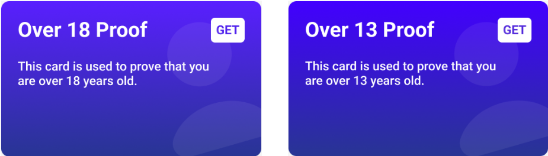
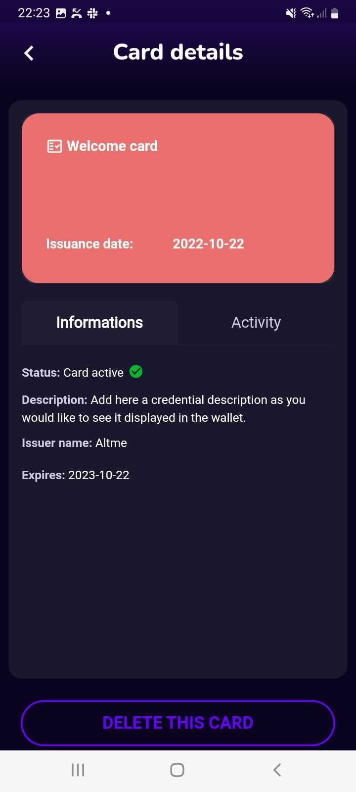
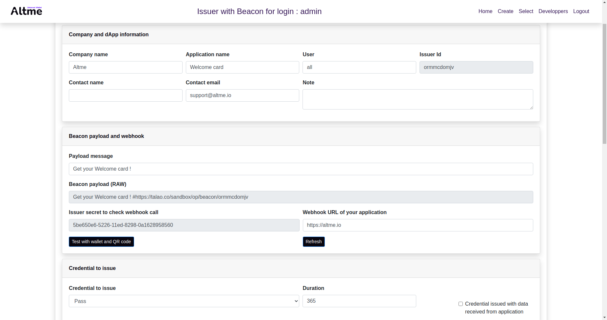
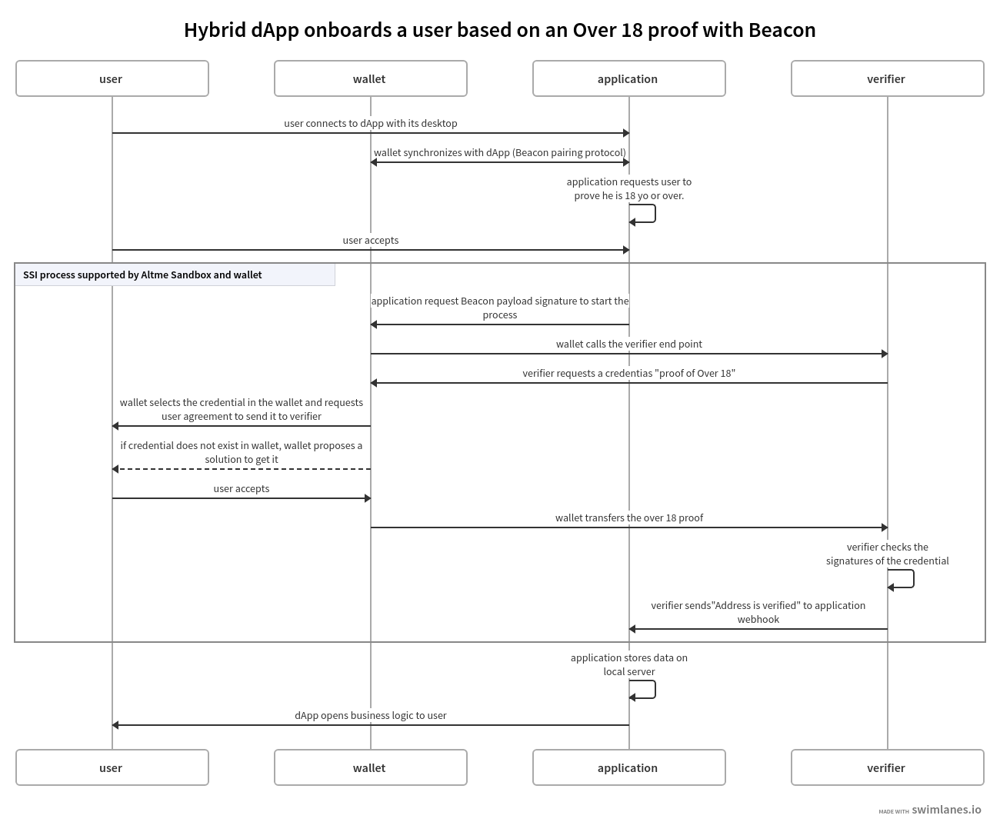

Beacon integration
==================

Overview
--------

Beacon is an awasome protocol to allow wallets and dApps to exchange data and sign transactions. All you need about Beacon is available there : https://docs.walletbeacon.io/

Integration with Beacon is extremely simple and you can test it in minutes. To initiate the protocol, it suffices to send a payload of RAW type to the signature of the wallet.

This payload will contain a message to your liking and an URL that you will obtain on the Altme Sandbox platform : https://talao.co

The URL is given just after the fragment "#" with no space. Example with a RAW message :

.. code-block:: javascript

    'Get your Welcome card ! #https://talao.co/sandbox/op/beacon/ormmcdomjv?id=1234'
               

User will be asked to sign the payload as usual but just after Altme wallet will start a process to request a credential to an issuer or present a credential to a verifier. 

User will be asked to sign the payload then to accept or reject the credential offered by an Issuer (or to select the credentials requested by a Verifier).

Those verifiable credentials (https://www.w3.org/TR/vc-data-model/) are json signed file stored in the smartphone. 

A verifiable credential of a natural person (user) is stored off-chain as it is personal data. The subject of the credential is the Decentralized IDentity (DID) attached to the wallet.
This identity is protected by a private key stored in the wallet aside the crypto privates keys.

Basically Beacon is used to initiate a Self Sovereign Identity standard protocol to request or present verifiable credentials/ verifiable presentations to issuers or verifiers. Other protocols like OpenId 4 SSI or WACI exist.

Verify the age of your users (+13, +18) in a dApp
-------------------------------------------------

Access to NFT marketplaces is legitimately limited to children. Controlling the age of your users is fundamental. With Altme you have a quick solution that is easy to set up.

Those "cards" are verifiable credentials and you will need to setup a Verifier to check them.

For that exemple we are going to use the Verifier Over 13 and Over 18 which are available on the Sandbox platform (Beacon Verifier).

After pairing with the wallet, the dApp code to launch that request is simple : 

Here are the calls to integrate in your dApp through a payload request for signature (both Verifiers are available on https://talao.co):

Example of an Over13 check   :

* verifier id : tuaitvcrkl 
* verifier secret : d461d33c-550f-11ed-90f5-0a1628958560
* TezID proof type : tuaitvcrkl

.. code-block:: javascript

    const signature = await client.requestSignPayload({
          signingType: beacon.SigningType.Raw,
          payload: 'I am over 13 years old#https://talao.co/sandbox/op/beacon/verifier/tuaitvcrkl?id=1234'
               })

Example of an Over18 check 

* verifier id : jvlfopeogt
* verifier secret : c8f90f24-5506-11ed-b15e-0a1628958560

.. code-block:: javascript

    const signature = await client.requestSignPayload({
          signingType: beacon.SigningType.RAW,
          payload: 'I am over 18 years old#https://talao.co/sandbox/op/beacon/verifier/jvlfopeogt?id=1234'
               })

The user will be asked to prove their age with a credential.

You can set up your own verifiers to receive data and verify your users' credentials.

NB : The "id" argument is useful to attach data to a web session or a blockchain address. That address could be for instance the one provided by Beacon after pairing.  

Receive the Verifier data with a webhook in your backend
--------------------------------------------------------- 

If you want to receive the data in your backend, create a webhook and copy the URL of the webhook in the page ("Webhook URL of your application").  

* POST request with header Content-Type : application/json and in option an API KEY authentication  'key' : <your_key>)' 
* Event types : 'VERIFICATION' or 'VERIFICATION _DATA'

Example :

.. code-block:: javascript 

   {"event": "VERIFICATION", "id": "1234", "presented": "2022-11-15T14:59:43Z", "vc_type": ["Over13"], "verification": true}

* event : string 'VERIFICATION' or 'VERIFICATION_DATA'
* id : string : The id passed through the call or the user blockchain address
* presented : string : date of the user connexion
* vc_type : ov13, over18, loyalty cards, etc
* verification : Signature check

Event "VERIFICATION_DATA" : in that case the webhook receives the full verifiable presentations signed by the wallet with the verifiable credentials signed by the issuer.

Below an example of a webhook code in python :

.. code-block:: python

    from flask import Flask, jsonify, request

    app = Flask(__name__)
    app.config.update(SECRET_KEY = "abcdefgh") # Flask key
    verifier_secret = 'c8f90f24-5506-11ed-b15e-0a1628958560' # take the client_secret from the platform https://talao.co
    
    @app.route('/webhook', methods=['POST'])
    def dapp_webhook() :
        if request.headers.get('key') != verifier_secret :
            return jsonify('Forbidden'), 403
        data = request.get_json()
        if data['event'] == 'VERIFICATION' :  # this is an event to catch a digest of the credential
            print(data)
            return jsonify('ok')
    
    if __name__ == '__main__': #  use Gunicordn for production
        IP = "127.0.0.1"
        app.run( host = IP, port=4000, debug =True)

On-chain and off-chain access with TezID
----------------------------------------

In some situations, it is important to be able to identify addresses that meet the Verify criteria without revealing the data. 
For this, it is possible to access on-chain and off-chain the addresses status through TezID. https://blog.tezid.net/tezid-9d82efbba006

At it’s core TezID is a Smart Contract with registered addresses and verified proofs for each address. 

TezID is composed of smart contracts to store the list of addresses associated with an on-chain verifier (proof type) and APIs to consult these off-chain addresses.

The documentation is available here https://github.com/tezid/docs#the-oracle-api

Example of the on-chain view on Ghostnet https://ghostnet.tzkt.io/KT1N2HacRzgmKZNmJ6DzRJ9q5bLVUvT6ZdnB/views

For our Over13 example the verifier proof type is tuaitvcrkl , see transaction  https://ghostnet.tzkt.io/tz1iAAJhH465Cf3BnsKQ744XHypQGY1v7Ps9/operations/

In order to guarantee the protection of personal data, the criteria (proof type) are not published on-chain.

Verify other data with other credentials
----------------------------------------

Many credentials are today available for user onboardings :

* Over 13
* Over 18
* Age range
* Nationality
* ID card
* Driver License
* Passport number (hash)
* Email proof
* Phone proof
* Custom : membership cards, vouchers, tickets,...

Issue a Welcome card in a dApp
------------------------------

You will need to create an Issuer.  

That card is a verifiable credential and you will need to get an Issuer. This card can be used as a Pass or to gives advantages ans discounts to your users as for instance a loyalty card.

For that exemple we are going to use the Issuer "Example 1" which is available on the Sandbox platform.

After pairing with the wallet, the dApp code to launch that request is simple : 

.. code-block:: javascript

    const signature = await client.requestSignPayload({
          signingType: beacon.SigningType.RAW,
          payload: 'Get your Welcome card ! #https://talao.co/sandbox/op/beacon/ormmcdomjv'
               })

Example of a Welcome credential card received in Altme :

    

You can find the Welcome card parameters (payload and client_secret) on the platform https://talao.co/sandbox. After login, choose the Beacon Issuer integration option.

Make a copy of this issuer and generates your own issuer. You can check the process and design of the credential card with the test button.

Check user data of your Issuer (no code)
----------------------------------------

You can have a look at all connexions data to your issuer with no code : click on the Activity button bottom down to get the list of connexions and the data sent by users.
You will get the address of your users.

Check user data of your Issuer with a webhook
---------------------------------------------- 

If you want to receive the data in your backend, create a webhook and copy the URL of the webhook in the page ("Webhook URL of your application").

Below an example of a webhook code in python :

.. code-block:: python

    from flask import Flask, jsonify, request

    app = Flask(__name__)
    app.config.update(SECRET_KEY = "abcdefgh")
    issuer_secret = '5be650e6-5226-11ed-8298-0a1628958560'
    
    @app.route('/webhook', methods=['POST'])
    def dapp_webhook() :
        if request.headers.get('key') != issuer_secret :
            return jsonify('Forbidden'), 403
        data = request.get_json()
        if data['event'] == 'ISSUANCE' :
            print(data)
            return jsonify('ok')
    
    if __name__ == '__main__':  # use Gunicorn for production
        IP = "127.0.0.1"
        app.run( host = IP, port=4000, debug =True)

The webhook tests the request against the issuer secret and gets the data transfered by the user as a json strucure with the event 'ISSUANCE'

Under the hood : the process flow of a Beacon Verifier
------------------------------------------------------

This is the most common use case because most web3 applications already have centralized management of their users.
It is likely that the application also keeps track of users' data in its local database for later use of the data (CRM).

Application is client/server with dApp features as SPA

There are 3 protocols that are used in these interactions:

* Wallet -Application: it is the synchronization between a crypto wallet and a dApp. We use Beacon in this example.   
* Wallet - Verifier: this is the protocol that makes it possible to transfer a credential from the wallet to a verifier. We use verifiable presentation request.  
* Verifier - dApp : As the dApp has a local server,  we use an application webhook.  

