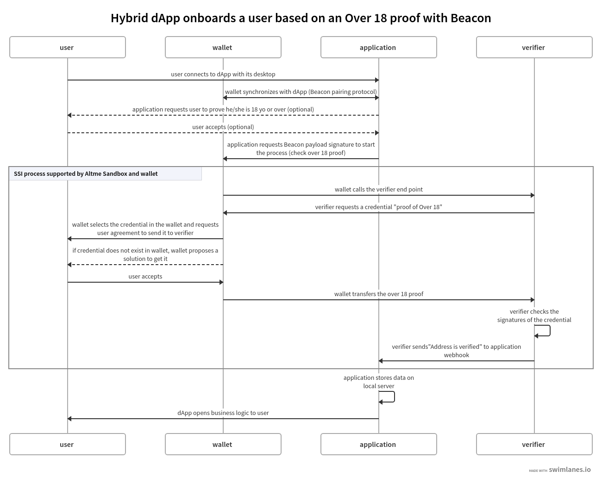

Beacon integration
==================

Overview
--------

Beacon is an awasome protocol to allow wallets and dApps to exchange data and sign transactions. All you need about Beacon is available there : https://docs.walletbeacon.io/

Integration with Beacon is extremely simple and you can test it in minutes. To initiate the protocol, it suffices to send a payload of RAW/MICHELINE or OPERATION type to the signature of the wallet.

This payload will contain a message to your liking and an URL that you will obtain on the Altme Sandbox platform : https://talao.co

The URL is given just after the fragment "#" with no space. Example with a RAW message :

.. code-block:: javascript

    'Get your Welcome card ! #https://talao.co/sandbox/op/beacon/ormmcdomjv?issuer=did:ethr:0x64098e894fea5b83e7e4c52a30d70b98e25bd9d5'
               

User will be asked to sign the payload as usual but just after Altme wallet will start a process to request a credential to an issuer or present a credential to a verifier. 
User will be asked to accept/reject the credential or select credentials. Those verifiable credentials (https://www.w3.org/TR/vc-data-model/) are json signed file stored in the smartphone. 
A verifiable credential of a natural person (user) is stored off-chain as it is personal data. The subject of the credential is the Decentralized Identity attached to the wallet.
This identity is protected by a private key stored in the wallet aside the crypto privates keys.

Basically Beacon is used to initiate a Self Sovereign Identity standard protocol to request or present verifiable credentials to issuers or verifiers. Other protocols like OpenId 4 SSI or WACI exist.

Create and issue a Welcome card to your users
----------------------------------------------

That card is a verifiable credential and you will need to get an Issuer. This card can be used as a Pass or to gives advantages ans discounts to your users as for instance a loyalty card.

For that exemple we are going to use the Issuer "Example 1" which is available on the Sandbox platform.

After pairing with the wallet, the dApp code to launch that request is simple : 

.. code-block:: javascript

    const signature = await client.requestSignPayload({
          signingType: beacon.SigningType.RAW,
          payload: 'Get your Welcome card ! #https://talao.co/sandbox/op/beacon/ormmcdomjv?issuer=did:ethr:0x64098e894fea5b83e7e4c52a30d70b98e25bd9d5'
               })

To sign the payload, you can also use a MICHELINE or OPERATION message after encoding the message in bytes as it is requested : https://tezostaquito.io/docs/signing/

Example of a Welcome credential card received in Altme :

.. image:: welcome_card.jpg
      :width: 200
    

You can find the Welcome card parameters (payload and client_secret) on the platform https://talao.co/sandbox. After login, choose the Beacon Issuer integration option.

Make a copy of this issuer and generates your own issuer. You can check the process and design of the credential card with the test button.

.. image:: sandbox_1.png

Get user data with no code from an Issuer
------------------------------------------

With no code you can have a look at all connexions : click on the Activity button bottom down to get the list of connexions and the data sent by users.
You will get the address of your users.

Get user data with a webhook from an Issuer
-------------------------------------------- 

If you want to receive the data in your backend, create a webhook and copy the URL of the webhook in the page ("Webhook URL of your application").

Below an example of a webhook code in python :

.. code-block:: python

    from flask import Flask, jsonify, render_template, request

    app = Flask(__name__)
    app.config.update(SECRET_KEY = "abcdefgh")
    issuer_secret = '5be650e6-5226-11ed-8298-0a1628958560'
    
    @app.route('/webhook', methods=['POST'])
    def dapp_webhook() :
        if request.headers.get('key') != issuer_secret :
            return jsonify('Forbidden'), 403
        data = request.get_json()
        if data['event'] == 'ISSUANCE' :
            print(data)
            return jsonify('ok')
    
    if __name__ == '__main__':
        IP = "127.0.0.1"
        app.run( host = IP, port=4000, debug =True)

Let's explain , the first function display the dApp code.
The second tests the request against the issuer secret and gets the data transfered by the user !

Check the age of your users (+13, +18) with a Verifier
------------------------------------------------------

Access to NFT marketplaces is legitimately limited to children. Controlling the age of your users is fundamental. With Altme you have a quick solution that is easy to set up.

Here are the calls to integrate in your dApp through a payload request for signature (both examples available on https://talao.co):

Example of an Over13 check with a MICHELINE message type :

* verifier id : tuaitvcrkl
* verifier secret : d461d33c-550f-11ed-90f5-0a1628958560

.. code-block:: javascript

    const signature = await client.requestSignPayload({
          signingType: beacon.SigningType.MICHELINE,
          payload: '05010033363054657a6f73205369676e6564204d6573736167653a20616c746d652e696f20323032322d31302d32365430393a32333a34365a204920616d206f766572203133207965617273206f6c642368747470733a2f2f74616c616f2e636f2f73616e64626f782f6f702f626561636f6e2f76657269666965722f74756169747663726b6c3f6973737565723d6469643a747a3a747a314e796a7254554e7844705061714e5a3834697047454c4163545759673673354475'
               })

Example of an Over18 check with a RAW message type

* verifier id : jvlfopeogt
* verifier secret : c8f90f24-5506-11ed-b15e-0a1628958560
* payload : 'I am over 18 years old#https://talao.co/sandbox/op/beacon/verifier/jvlfopeogt?issuer=did:tz:tz1NyjrTUNxDpPaqNZ84ipGELAcTWYg6s5Du'

.. code-block:: javascript

    const signature = await client.requestSignPayload({
          signingType: beacon.SigningType.RAW,
          payload: 'I am over 18 years old#https://talao.co/sandbox/op/beacon/verifier/jvlfopeogt?issuer=did:tz:tz1NyjrTUNxDpPaqNZ84ipGELAcTWYg6s5Du'
               })

Example of an Over18 check with an OPERATION message type

.. code-block:: javascript

    const signature = await client.requestSignPayload({
          signingType: beacon.SigningType.OPERATION,
          payload: '03010033363054657a6f73205369676e6564204d6573736167653a20616c746d652e696f20323032322d31302d32365431303a33313a33315a204920616d206f766572203138207965617273206f6c642368747470733a2f2f74616c616f2e636f2f73616e64626f782f6f702f626561636f6e2f76657269666965722f6a766c666f70656f67743f6973737565723d6469643a747a3a747a314e796a7254554e7844705061714e5a3834697047454c4163545759673673354475'
               })

User will be requested to prove his age. If user has the over13/over18 credential in his wallet he will be able to get the credential card and your backend webhook will receive a call with his address as verified.

You can setup your own verifiers to receive data or check the credentials of your users.

Get user data with a webhook from a Verifier
-------------------------------------------- 

If you want to receive the data in your backend, create a webhook and copy the URL of the webhook in the page ("Webhook URL of your application").

Below an example of a webhook code in python :

.. code-block:: python

    from flask import Flask, jsonify, render_template, request

    app = Flask(__name__)
    app.config.update(SECRET_KEY = "abcdefgh") # Flask key
    verifier_secret = 'c8f90f24-5506-11ed-b15e-0a1628958560' # take the client_secret from the platform https://talao.co
    
    @app.route('/webhook', methods=['POST'])
    def dapp_webhook() :
        if request.headers.get('key') != verifier_secret :
            return jsonify('Forbidden'), 403
        data = request.get_json()
        if data['event'] == 'VERIFICATION' :
            print(data)
            return jsonify('ok')
    
    if __name__ == '__main__':
        IP = "127.0.0.1"
        app.run( host = IP, port=4000, debug =True)

The webhook function tests the request key against the verifier_secret and gets the json data transfered by the issuer.

Process flow (+13, +18) use case
---------------------------------

This is the most common use case because most web3 applications already have centralized management of their users.
It is likely that the application also keeps track of users' data in its local database for later use of the data (CRM).

Application is client/server with dApp features as SPA

There are 3 protocols that are used in these interactions:

* Wallet -Application: it is the synchronization between a crypto wallet and a dApp. We use Beacon in this example.   
* Wallet - Verifier: this is the protocol that makes it possible to transfer a credential from the wallet to a verifier. We use verifiable presentation request.  
* Verifier - dApp : As the dApp has a local server,  we use an application webhook.  

