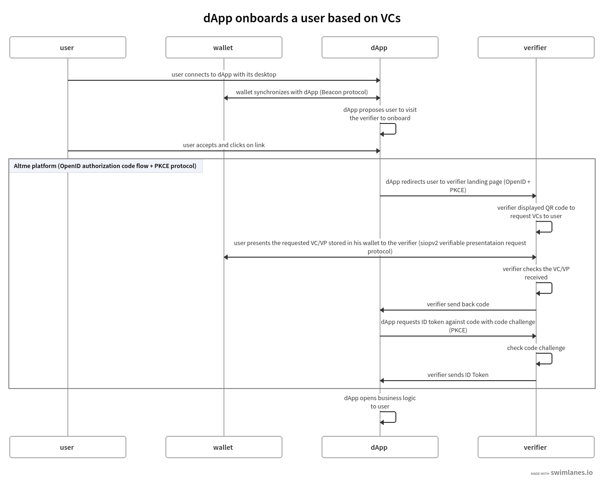
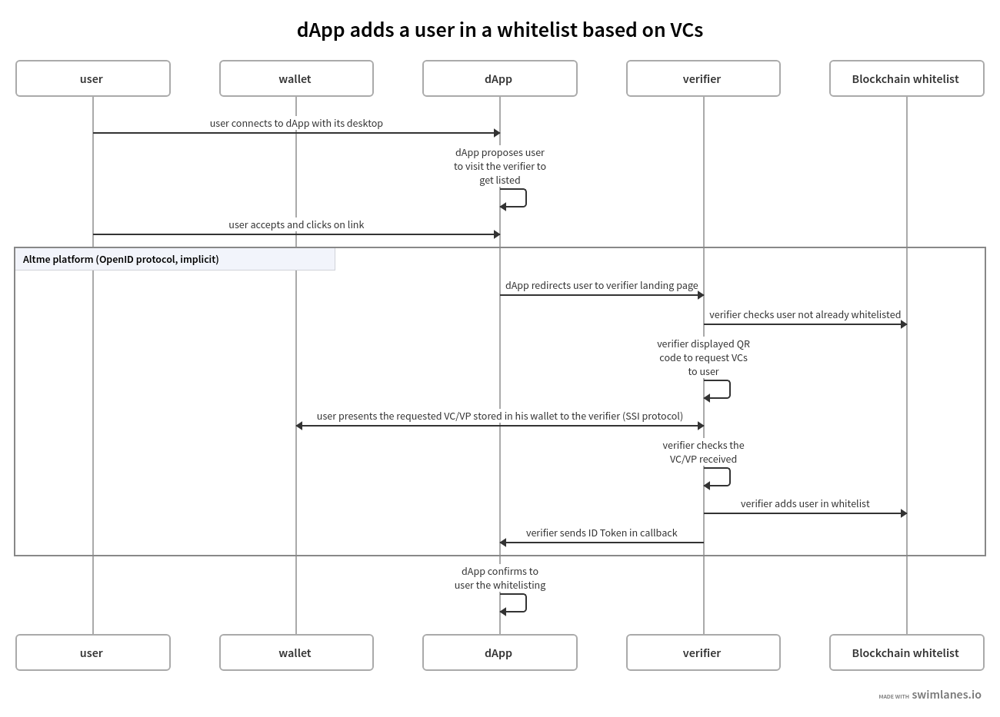

Flow between wallet, dApp and Verifier
======================================

Hybrid dApp onboards a user with VCs
------------------------------------

This is the most common use case because most web3 applications already have centralized management of their users.
It is likely that the application also keeps track of users' data in its local database for later use of the data (CRM).

Application (Hybrid dApp) is client/server with dApp features as SPA

There are 3 protocols that are used in these interactions:

* Wallet -Application: it is the synchronization between a crypto wallet and a dApp. We use Beacon in this example.   
* Wallet - Verifier: this is the protocol that makes it possible to transfer a credential from the wallet to a verifier. We use verifiable presentation request.  
* Verifier - dApp : As the dApp has a local server,  we use an application webhook.  

.. image:: hybrid_onboard_user_with_beacon.png

dApp onboards a user with VCs
-----------------------------

There are 3 protocols that are used in these interactions:

* Wallet - dApp: it is the synchronization between a crypto wallet and a dApp. The wallet must confirm that it owns the private key associated with its address by signing a payload. We use Beacon.   
* Wallet - Verifier: this is the protocol that makes it possible to produce a VP and then transfer it to the verifier from the wallet. We use verifiable presentation request.  
* Verifier - Application : we use OpenID authorization code flow with PKCE.  

dApp adds a user in whitelist
-----------------------------

There are 2 protocols that are used in these interactions:

* Wallet - Verifier: this is the protocol that makes it possible to produce a VP and then transfer it to the verifier from the wallet. We use siopv2 or verifiable presentation request.  
* Verifier - dApp : We use OpenID implicit flow which is just a call back without need to authenticate.  

