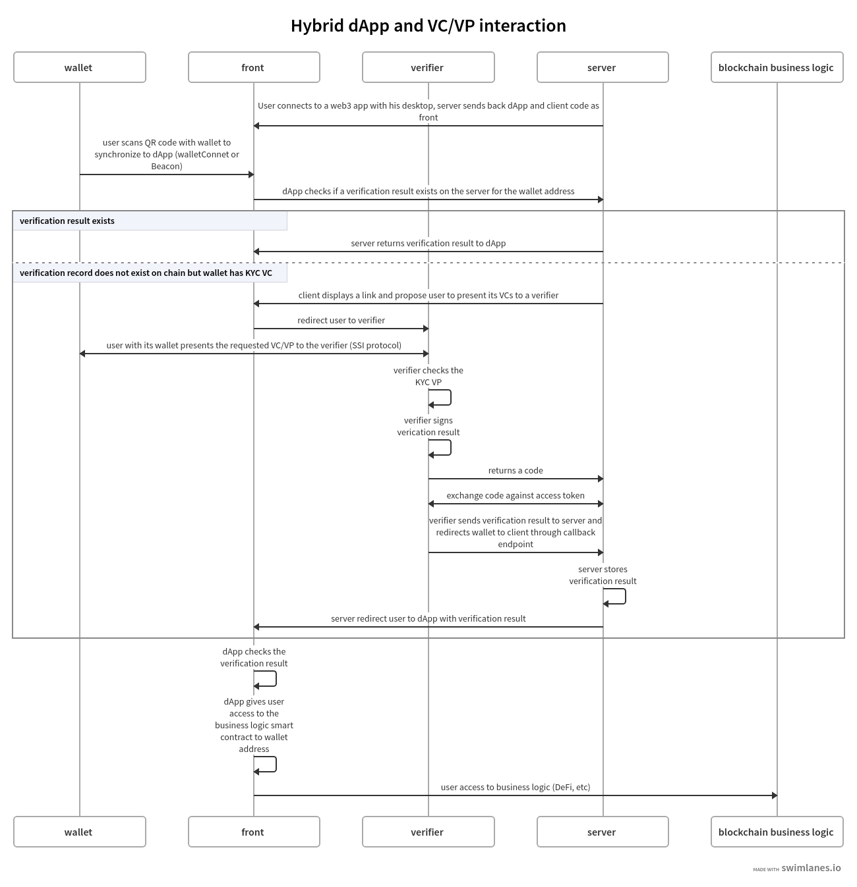
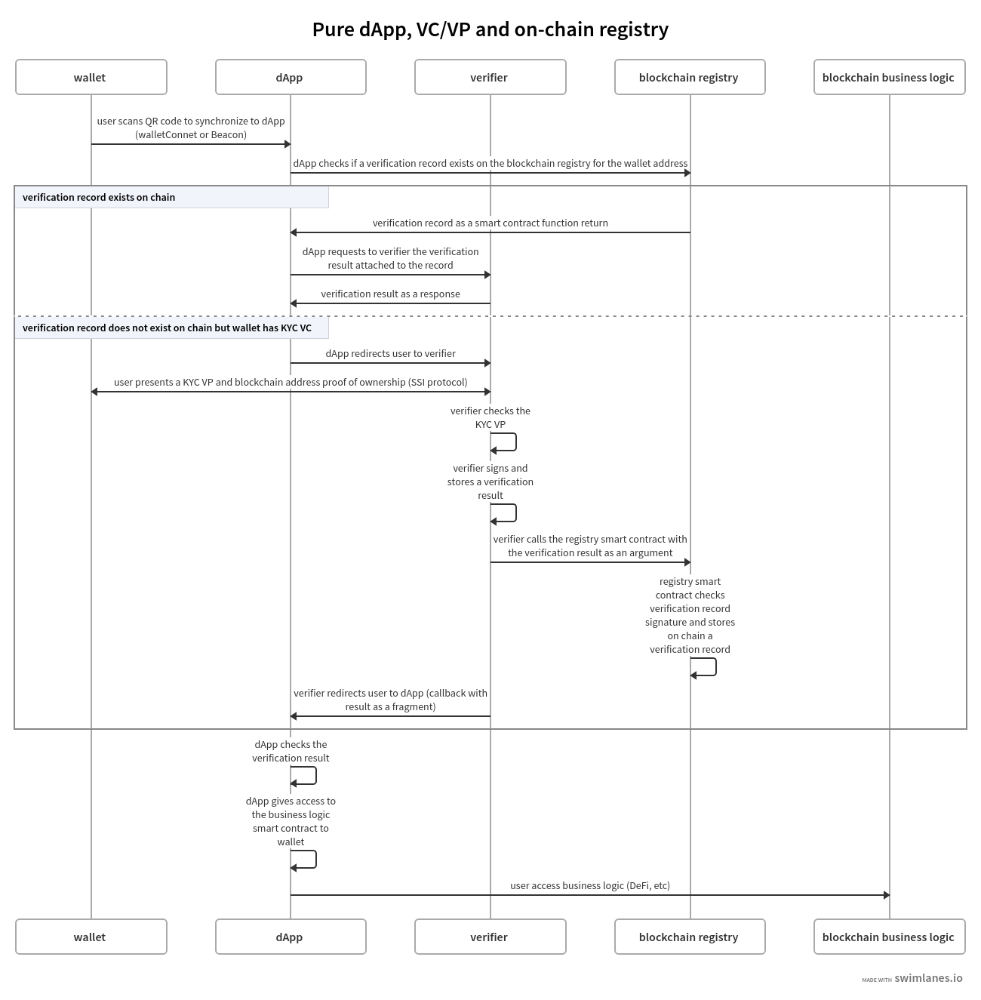
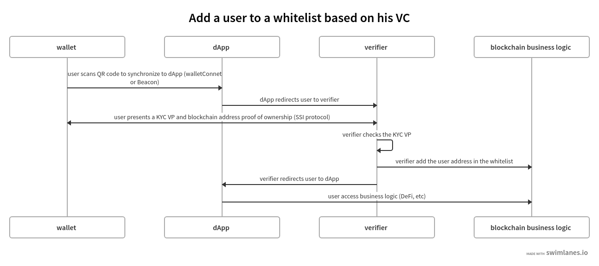

Overview
========

Internet applications suffer from the lack of proper identity management. If TCP/IP had been imagined after the publication of the RSA algorithm, it is likely that we would have a public key associated with each of the communication cards of our computers.
The rise of the web in the 90s favored the emergence of servers that concentrated user access and capitalized on the data stored to the point of being today the identity providers of a significant part of humanity. 
The GAFAMs set up an identity layer above TCP/IP because there was none and we all missed it.

For about ten years now, the concern for the protection of personal data has become a major subject for policies and new paths have been opened up, such as in particular the concepts of 
Self Sovereign Identity (SSI) which allows everyone to have their data in the format electronically as is done for paper data.
From our point of view, what is called web3 is today the culmination of these approaches, web3 is not just cryptos and finance, 
web3 is also the decentralization of data and perhaps even above all data. ..

The Altme wallet that we offer is a so-called "Universal" wallet.
It is universal in that it allows you to manage in the same mobile application both your cryptos, NFT and your identity data.
Identity must be understood in the broadest sense, this of course includes identity documents but also the personal data of our associative, cultural, professional and economic life.
Altme is simply an electronic version of the wallet we've had in our pockets for years. A Universal wallet is ultimately very common.
The Altme wallet is a new generation of wallet, it is likely that in the medium term other provider wallets will see the benefit of associating data with the transfer of assets.
identity allows a third party to manage its risk in an exchange. Identity is essential in any economic system.

Web3 suffers like web2 from the lack of proper identity management. On the other hand, there are particularities which make SSI integration even more difficult:

* The users of web3 applications are even less docile than those of internet applications. they are more concerned with the management of their data because decentralized finance has already done its work.
* Web3 applications require on-chain data integration but the verifiable credentials we use in the SSI are off-chain by construction so we have to find solutions, tricks to make a bridge that allow both to use the technology provided by the blockchain while guaranteeing the protection of user data.

Web3 and SSI components, protocols and more 
============================================

Universal wallet
----------------
A universal wallet is a wallet that carries the private keys of its crypto accounts and the verifiable credentials of its decentralized identity.
A universal wallet can buy, transfer and receive cryptos and NFTs and also receive and present verifiable credentials and verifiable presentations to the W3C standard.
This also implies that a universal wallet supports both connection protocols with a dApp such as Beacon (or its walletConnect equivalent on EVM) and SSI protocols (WACI PEX, SIOPv2, ...DIDComm,..).

DID for universal wallet
------------------------
We have chosen to use the DID method did:key for practical reasons.
It is a DID method which has numerous libraries and is today supported by the EBSI/ESSIF ecosystem.
Other DID methods can be used, but it seems to us, on the other hand, that it is preferable to be relatively far from the DID methods which are deduced from the blockchains and
which could leave the opportunity to confuse the private key of an identity with that of an account used for a transaction.

A description of the did key method is available here : https://w3c-ccg.github.io/did-method-key  

DID private key vs blockchain address private key
-------------------------------------------------
It seems to us for example extremely dangerous to use by simplification the same private key of a blockchain address to support a decentralized identity.
The obvious risk is to eventually have an immediate correlation between an identity document issued for a user DID and blockchain transactions. 
For this, the choice we have made is to derive the private key(s) of our identity with a specific path different from that used for the crypto wallets.
Currently we use the derivation m/44'/5467'/0'/0/x for the generation of identity keys which avoids any collision with that used for Tezos m/44'/1729'/0'/0/ x while keeping the same passphrase.

The proof of address ownership VC
---------------------------------
It is a VC which is issued by the crypto wallet and whose subject is the identity carried by the wallet. Once presented to a verifier, it is a credential that has the signature of the two private keys.
From our point of view, this VC is one of the most important of the universal wallets because it makes it possible to establish a link between the credentials and the addresses
of the transactions while guaranteeing the maximum protection of the user's data.
If it is desired to verify that the owner of an address A1 is over 18 years old, the verifier will receive a VC/VP over 18 and a VC/VP which proves that the identity subject of the Over18 (vc.credentialSubject.id) is indeed the owner of the address A1.

Verifier
--------
The Verifier is the module of an application or an application whose purpose is to control the accuracy and origin of Verifiable Credentials / Verifiable presentations of a user (Holder).
The protocols supported by the Verifiers are the subject of numerous documentation in the repositories of the DIF and in those of the SSI ecosystems. In our case we opted for the use of Verifiable Presentation Request (w3C draft) or SIOPv2.
The simplest use cases of a Verifier consist in validating that a user has the necessary credentials (Over 18 or Over 13 to access a marketplace, KYC/AML to access a DEX, etc).

It is therefore relatively basic information that is generally called a "verification result" and which is then transferred to the dApp. 
This information contains very little personal data of the user but on the other hand it is possible that the Verifier received and stored to carry out its process a greater number of information. 
For this reason in particular, it seems to us that the Verifier must remain an external and independent service.

Hybrid dApp
------------
What we call a Hybrid dApp is an application that uses a back end to store information local to the application.
A large part of decentralized game applications or NFT marketplaces are built on this model.
In particular, a centralized database is used to store the data of users who are authenticated by their blockchain address when synchronizing the wallet with Beacon for example.

Pure dApp
---------
What we call a Pure dApp is an application that has no back end. Many DeFi applications work on this model. 
The particularity of this architecture is that it is not possible to keep information from a user (VCs/VPs or verification result) locally and therefore it is necessary or efficient to have an on-chain registry.

On chain registry
-----------------
This is where the blockchain comes into play in the interaction of the SSI and web3.
VCs are off-chain by nature because they protect user data and regulations in many countries now impose the right to be forgotten in particular.
It is therefore not possible to have a copy of a VC on-chain. It seems to us that even a "verification result" is already personal data that should not be exposed on chain.
The choice we have made is to create and  keep a "verification flag" on-chain. This marker then allows us to request from the verifier the associated "verification result" which will have been stored off-chain.

The result verification model that we have chosen is the one proposed by the excellent Verité team, which has done a lot of work on the subject.
https://docs.centre.io/blog/verification-patterns-1#verification-result

Protocols between wallet, application and Verifier
--------------------------------------------------

There are at least 3 protocols that are used in these interactions:

* Wallet - dApp: it is the synchronization between a crypto wallet and a dApp. The wallet must confirm that it owns the private key associated with its address by signing a payload. We will use Beacon.   
* Wallet - Verifier: this is the protocol that makes it possible to produce a VP and then transfer it to the verifier from the wallet. We will use an SSI protocol type siopv2 or verifiable presentation request with a credential manifest.  
* Verifier - Application (hybrid or pure dApp): we will use OpenID which has the merit of being known. Depending on whether the application has a backend or not, we will use authorization code flow or implicit code flow.  

Hybrid dApp architecturee with universal wallets
================================================

Pure dApp architecturee with universal wallets
==============================================

Whitelist use case
====================

