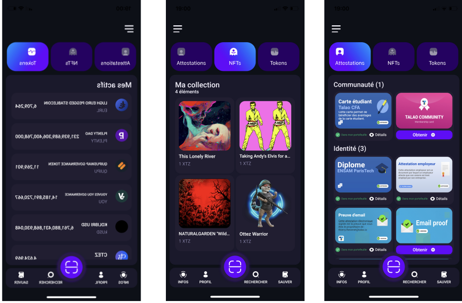
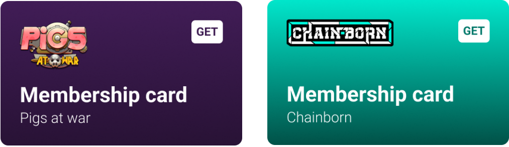
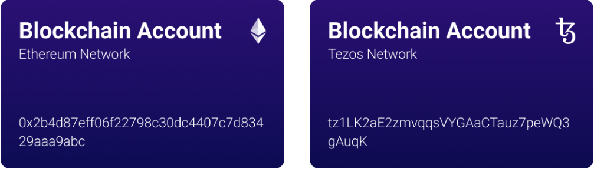
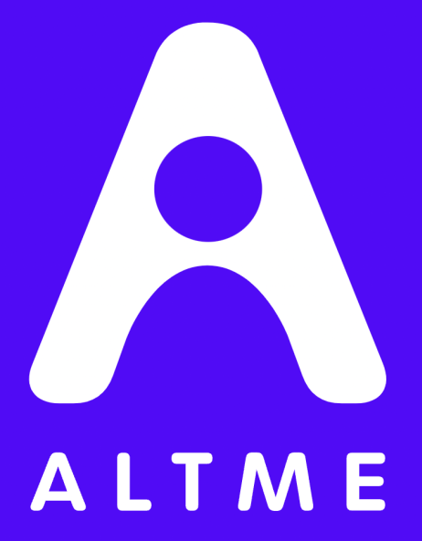

Introduction
============

Internet applications suffer from the lack of proper identity management. TCP/IP was designed as a network of networks with the sole purpose of identifying machines and not their users.
The rise of the web in the 90s favored the emergence of servers that concentrated user access and capitalized on stored data to the point of being today the identity providers of a significant part of humanity.
The GAFAMs implemented an identity layer above TCP/IP because there was none and we all missed it.

For about ten years now, the concern for the protection of personal data has become a major subject for policies and new paths have been opened up, such as in particular the concepts of 
Self Sovereign Identity (**SSI**) which allows everyone to have their data in the format electronically as is done for paper data.

Web3 suffers like web2 from the lack of proper identity management. On the other hand, there are particularities which make SSI integration even more difficult:

* The users of web3 applications are even less docile than those of internet applications. they are more concerned with the management of their data because decentralized finance has already done its work.
* Web3 applications require on-chain data integration but the verifiable credentials we use in the SSI are off-chain data container by construction so we have to find solutions, tricks to make a bridge that allow both to use the technology provided by the blockchain while guaranteeing the protection of user data.

**Web3 + SSI is true decentralization : My keys, my data, my assets !**. 

What is Self Sovereign Identity ?
---------------------------------

Self-Sovereign Identity, or SSI, is a new technology compatible with blockchain that gives users and organizations the ability to control their own digital credentials
and identity data, rather than relying on a central authority or central database to manage their personal information. SSI does not require bockchain as a source of trust but DLT makes it easier to implement.

With SSI, users are able to store, manage and share their personal data in a decentralize manner, enabling greater privacy and security. 
SSI also uses Zero-Knowledge Proof, selective disclosure and data minimization to protect user privacy.

In practice SSI is made up of international standards defined by the World Wide Web Consortium (W3C) https://www.w3.org/. 
Two documents are today W3C recommendations :

* **Verifiable credentials** data model https://www.w3.org/TR/vc-data-model/ : an **off-chain data container** to gather personal data.
* **Decentralized Identifiers** https://www.w3.org/TR/did-core/ : a new generation of identifiers (DID) whose possession can be proven. 

As opposed to client-server architectures which are carried by 2 actors, SSI implements 3 actors : Issuers, Verifiers and Holders.

**Issuers** : they hold and issue verifiable digital credentials such as certificates of identity (ID card, company or service ID card …),
driver’s licenses (car/motorcycle, airplanes …), certificates (high school diploma, bachelor’s degree, master’s degree … ), confirmations (authenticity confirmation, vaccination confirmation, …) 
qualifications (license to practice medicine, nurse, master painter …), powers (official authority, residence authority …), 
qualifications (further education certificates, personal certificates …).

**Verifiers** : the acceptance points in this SSI ecosystem need verifiable digital evidence to use and further process the presented digital proof in a process or application.
For this purpose, the application can use the cryptographic from the SSI blockchain to verify the identity of the issuers. 
It is essential that the transmission of the verifiable digital evidence between the owner and the verifier is encrypted but verifibale credentials themselves are not required to be encypted.

**Holders** (or users) : they usually have a corresponding SSI app named wallet on their mobile device or desktop, which stores SSI private keys and the digital verifiable credentials. 
It is also possible to use a cloud agent. Holders can request all verifiable digital proofs from the corresponding issuers and store them in their own SSI wallet.

|

.. image:: ecosystem.svg
      :width: 1000
      :align: center

.. centered:: Image from W3C Verifiable credential V2.0

|
The use of a blockhain to support SSI is not mandatory and it is necessary to understand the real relationship between SSI and blockchains :
Verifiable credentials are totally off-chain data containers. The signature of the verifiable credential is integrated into the digital document itself, so it does not require a transaction on a blockchain.
On the other hand, the latter brings significant added value as a decentralized source of trust for integrity content protection. An example is the link between the DID of an Issuer or a Verifier
and their cryptographic materials. The data likely to be carried by a decentralized registry are numerous: such as verifiable credential data model, revocation registries, 
public issuer keys, trusted issuer and verifier registries. See **Verifiable Data Regitry**.

For a natural person the added value of SSI is huge. It is a game changer compared to other "identity solutions". An SSI wallet is different from a solution 
such as the Apple wallet because the user is the sole owner of his wallet and so he can add new credentials to it without asking for authorization from a third party.
SSI is also different from a solution such as Google Connect or FranceConnect (Eidas v1) because the user carries his data on him and is able to authenticate with a third party without intermediation.

The verifiable credential model of SSI is also an improvment of the X509 certificate format first published in 1988 as authentication materials and identification attributes
are now splited into 2 documents (DID Document and verifiable credentials) allowing simple key rotation and multiple asociations for long term use.

The Self Sovereign Identity model has been integrated into several ecosystems around the world and in particular in Europe with the deployment of the infrastructure
for the European Blockchain **EBSI** (https://ec.europa.eu/digital-building-blocks/wikis/display/EBSI/Home ) which carries a large number of cross-border use cases in education, employment, health, etc.

Altme solution suite is made up of 3 components
-----------------------------------------------

Altme offers 3 components to implement SSI in Web3 applications. On the other hand, it is important to appreciate that the strength of the SSI model is interoperability and 
therefore all the components offered by Altme are available in open source and implement **protocols and standards recognized by the W3C and shared by the community**.

* **Altme Wallet** : The user friendly SSI mobile wallet for web3 applications
* **Altme Saas** : The next generation platform to build Issuers and Verifiers in minutes
* **Altme Web3 Issuer** : A trusted issuer of Web3 verifiable credentials 

The open source repositorory is available there : https://github.com/TalaoDAO . 

Altme Wallet
------------

Altme Wallet is an universal wallet
***********************************

The Altme Wallet that we offer is a so-called "Universal" wallet. **Altme Wallet is a user friendly SSI mobile wallet with crypto features**. 

It is universal in that it allows you to manage in the same mobile application both your cryptos, NFT and your identity data in a decentralized way.

Identity must be understood in the broadest sense, this of course includes identity documents but also the personal data of our associative, cultural, professional and economic life.
Altme is simply an electronic version of the wallet we've had in our pockets for years. A Universal wallet is ultimately very common.

The Altme Wallet is a new generation of wallet, it is likely that in the medium term other provider wallets will see the benefit of associating data with the transfer of assets.
identity allows a third party to manage its risk in an exchange. Identity is essential in any economic system.

An universal wallet is a wallet that carries the private keys of its crypto accounts and the verifiable credentials of its decentralized identity.

An universal wallet can buy, transfer and receive cryptos and NFTs and also can receive, store and present verifiable credentials.

|

.. centered:: The 3 most important screens of Altme Wallet with NFTs, Cryptos and Cards (verifiable credentials) carry by one user.

|

This also implies that a universal wallet supports both connection protocols with a dApp such as Beacon (or its walletConnect equivalent on EVM) and SSI protocols (WACI PEX, SIOPv2, ...DIDComm,..).
  
Altme Wallet is available on `Apple Store <https://apps.apple.com/fr/app/altme/id1633216869>`_ and `Google Play <https://play.google.com/store/apps/details?id=co.altme.alt.me.altme>`_  .

Altme Wallet is a user friendly SSI wallet ready for production use
*******************************************************************

Everyone knows that SSI wallets are boring and their interface is not very well done. 
The fact is that there are few SSI wallets available on the market and many SSI wallets are only Proof of Concept with relatively few real users.

The particularity of Altme Wallet is that it is also a crypto wallet and that the market and the level of user experience of crypto wallets is extremely high and has been for several years.

Altme Wallet's design teams have therefore set out to create a wallet whose user experience and interface are as efficient as the best crypto wallets on the market.  
Moreover, the interface is improved every day with feedback from many users of SSI-Web3 applications currently in production. 

In order to allow Issuers to provide the best UX and UI, the Altme Wallet implement the **DIF Wallet Rendering standards**  https://identity.foundation/wallet-rendering/.

|

.. centered:: Wallet rendering of crypto games membership cards as verifiable credentials in Altme Wallet

|

Altme Wallet credentials and keys backup and recovery
******************************************************

Safeguarding verifiable cerdentials and private keys associated with cypto accounts and the key to one's identity is fundamental.

With regard to private keys, it is possible to save your **passphrase of 12 keywords in BIP39 format** (https://iancoleman.io/bip39/) which contains both the private key of your identity and those of your crypto accounts. 
As specified above, the derivation of the blockchain and identity keys is different to avoid any possible correlation.

With regard to the saving of verifiable credentials, it is possible to save them encrypted on the medium of your choice with, to simplify, the same passphrase of 12 keywords.

Altme Saas
-----------

Altme Saas is a low code solution to build Issuers and Verifiers in minutes
****************************************************************************

Altme Saas is a **next-generation platform** to integrate Decentralized Identity solutions in an application.

Altme Saas is a no code or low code platform to generate issuers and verifiers. The platform is an open source project : https://github.com/TalaoDAO/sandbox

To use Altme Saas, you don't need to learn Verifiable Credentials standards, DIDs signature or how to work with a complex an unstable SDK.

Instead, Altme Saas uses OpenID for Web2 aplications and dapp-to-wallet protocols for Web3 applications as a simple and familiar method to integrate issuers and verifiers.
All the complexity of the protocols and standards used by SSI wallets are managed by the platform. 
You can focus on your application and leave Altme Saas manages authentication, identification or credential issuance.

For web2 applications Altme Saas is compliant with **NodejS, Python, Ruby, Go, C, PHP, Java, Wordpress, Webflow...**.

For web3 applications Altme Saas supports **WalletConnect and Tezos Beacon**.

Documentation :

* Go to https://sandbox-doc.readthedocs.io/en/latest/getting_started.html for a quick startup
* Go to https://sandbox-doc.readthedocs.io/en/latest/code_openid.html for an OpenID integration 

The Altme Saas platform is in Beta, access is free : https://talao.co

Altme Web3 issuer
-----------------

Altme Web3 Issuer is a SSI issuer for web3 use cases
*****************************************************

Altme Web3 Issuer supports more than 20 credentials see : https://talao.co//sandbox/saas4ssi/credential_supported . 

Alltme Web3 Issuer provides verifiable credentials in the format of Self Sovereign Identity for users of Crypto games, NFT Marketplaces, DeFi and Metaverse.
Verifiable Credentials are off-chain data container, for privacy protection and GDPR compliance they are never published on-chain as NFT or SBTs.

Many credentials are today available specifically for Web3 use cases : 

* Loyalty cards and vouchers for gaming platforms
* Custom Gamer Pass and DeFi pass
* Mobile device information
* Discord or Twitter account proof
* Age Over 13 and Age Over 18 credential
* Age range credential
* Nationality proof
* Residency proof
* AML check
* ID card, Driver License, Passport as full KYC
* Unique identifier for DAO voting
* Email proof and Phone proof for authentication
* Verifiable credentials for blockchain account proof of ownership for Tezos, Ethereum, Polygon, Fantom and Binance chain
* Company pass

|

.. image:: over18-13.png
      :align: center

.. centered:: Wallet rendering of Age Over verifiable credentials in Altme Wallet

|

We apply the principle of data minimization and thus credentials always carry the minimum data required for user needs. All credential data are displayed in the wallet for user data control.

Altme Web3 Issuer partners for identification
**********************************************

Identification is a complex activity. In order to guarantee the best level of quality, Altme has selected 2 recognized companies for the production of basic data:

**Yoti**: https://www.yoti.com/: The partnership we have with Yoti concerns its activity in artificial intelligence and in particular the ability
to assess the age of a user based on photos of identify. This approach has the advantage of allowing a rapid evaluation with a margin of error of 
less than 2 years in 90% of cases. Using an AI helps to minimize friction with Web3 users who are not inclined to present their ID card for further
identification. Based on Yoti's age rating, Altme is able to sign proof of age +13, +18 and age range.

**Passbase**: https://passbase.com: The partnership with Passbase concerns its identification activity with 3D liveness test and authentication of documents
(driver's license, identity card or passport). Based on the information provided by Passbase Altme is able to sign credentials with the bare minimum of 
data: proof of nationality, residence, birth date, sex, age and of course the standard DeFI KYC and AML. A unique identification number for voting in DAOs is also available.

Altme Web3 Issuer DID
**********************

Altme Issuer DID is **did:web:app.altme.io:issuer**

Altme Issuer DID Document is available through the DIF Universal Resolver : https://dev.uniresolver.io/ and see below its content.
 

.. code-block:: JSON

      {
            "@context": [
                  "https://www.w3.org/ns/did/v1",
                  {
                        "@id": "https://w3id.org/security#publicKeyJwk",
                        "@type": "@json"
                  }
            ],
            "assertionMethod": [
                  "did:web:app.altme.io:issuer#key-1"
            ],
            "authentication": [
                  "did:web:app.altme.io:issuer#key-1"
            ],
            "capabilityInvocation": [
                  "did:web:app.altme.io:issuer#key-1"
            ],
            "id": "did:web:app.altme.io:issuer",
            "keyAgreement": [
                  "did:web:app.altme.io:issuer#key-1"
            ],
            "verificationMethod": [
                  {
                        "controller": "did:web:app.altme.io:issuer",
                        "id": "did:web:app.altme.io:issuer#key-1",
                        "publicKeyJwk": {
                              "crv": "Ed25519",
                              "kty": "OKP",
                              "x": "FUoLewH4w4-KdaPH2cjZbL--CKYxQRWR05Yd_bIbhQo"
                        },
                        "type": "JwsVerificationKey2020"
                  }
            ]
      }

Altme used some other DIDs (deprecated)

* Tezos Mainnet : did:tz:tz1NyjrTUNxDpPaqNZ84ipGELAcTWYg6s5Du
* DNS  : did:web:talao.co
* Ethereum Mainnet : did:ethr:0x61fb76ff95f11bdbcd94b45b838f95c1c7307dbd

Give an Identity to your crypto wallet
--------------------------------------

This is a service offered by Altme, free and available here :  https://app.altme.io/wallet-link .

Current crypto wallets like Metamask, Trust wallet, Ledger or Temple wallet for Tezos do not carry personal data as verifiable credentials. 
We think that they will do it in a more or less close future to adapt to regulations but for the moment 
it is therefore extremely difficult to know the user who is carrying out a transaction. Anonymity is an important benefit of blockchain technology but in some cases this can be a problem.

The use of processes such as the **KYC carried out by the site of the Web3 platform responds badly** to this problem for several reasons:

* It reveals all of a user's personal data to the Web3 operator and some of it is unnecessary for the strict need of the application.
* It is often impossible to ensure that the crypto address is indeed owned by the person performing the KYC.
* KYC is the only proof that it is possible to produce even though the identity of a person can be proven by a large number of documents (diplomas, employer certificate, health card, proof of address, etc.)
* KYC is often attached to a single address on a single blockchain

The use of Altme Wallet easily solves these problems because it allows the user to transfer only the minimum, necessary information, to choose the attribute(s) 
of his identity from different documents and then to associate them with an address group. possibly on different blockchains.

However, to take advantage of SSI features with a crypto wallet, it is necessary to associate your prefered crypto wallet with Altme Wallet.

The association of a crypto wallet to Altme Wallet can be done in 2 different ways:

* By transferring the private key (or passphrase) from the crypto wallet to the Altme Wallet. The crypto account is then available on Altme Wallet as if it had been created by Altme Wallet.
* By creating in Altme Wallet a proof of blockchain account ownership **without revealing the private key of the crypto wallet**. This is possible using the Beacon Tezos or WalletConnect EVM protocols to authenticate with the crypto wallet.

The Altme Wallet can therefore carry the verifiable credentials of the user of a wallet such as Metamask or Ledger, which then simplifies and secures the onboarding of this user on web3 platforms.

Crypto wallets supported are (none exhaustive list)  : 

* Tezos : **Temple mobile, Temple Web Extension, Air Gap, Kukai, Digital Art Autonomy, Umami**
* EVM : **Metamask mobile, Metamask web extension, Ledger Live, Ledger, Trezor, Trust Wallet, Coinbase wallet, My Ether Wallet, Rainbow, Argent Wallet**

  
Go to  https://app.altme.io/wallet-link to test the possibility to use Altme Wallet with your prefered crypto wallet without revealing the crypto wallet private key.

Technical considerations
-------------------------

Decentralized IDentifiers (DIDs), private keys and derivation path
*******************************************************************

For Altme Wallet we have chosen to use the DID method did:key for practical reasons.

It is a DID method which has numerous libraries.
Other DID methods can be used, but it seems to us, on the other hand, that it is preferable to be relatively far from the DID methods which are deduced from the blockchains and
which could leave the opportunity to confuse the private key of an identity with that of an account used for a transaction.

A description of the did key method is available here : https://w3c-ccg.github.io/did-method-key  

Altme Wallet can also support : **did:ebsi, did:tz; did:pkh; did:sol; did:ion, did:eth, did:web**. 

For private keys it seems to us for example extremely dangerous to use by simplification the same private key of a blockchain address to support a decentralized identity.

The obvious risk is to eventually have an immediate correlation between an identity document issued for a user DID and blockchain transactions. 

For this, the choice we have made is to derive the private key(s) of our identity with a specific path different from that used for the crypto wallets.
Currently we use the derivation **m/44'/5467'/0'/0** for the generation of identity keys which avoids any collision with that used for Tezos wallets m/44'/1729'/0'/0 or Metamask m/44'/60'/0'/0 while keeping the same passphrase.
Altme is registered on the BIP44 registry list for the path "5467" : https://github.com/satoshilabs/slips/blob/master/slip-0044.md 

Altme Wallet and Altme Web3 Issuer support **Ed25519, Secp256k1, P-256 and RSA keys**.

The proof of blockchain address ownership
******************************************

It is a verifiable credential which is issued by the "crypto account" of the wallet itself and whose subject is the identity (DID) carried by the wallet. Once presented to a verifier, it is a credential that has the signature of the two private keys.

From our point of view, this credential is one of the most important of the universal wallets because it makes it possible to establish in a peer to peer mode a link between the DID and the addresses
of the transactions while guaranteeing the maximum protection of the user's identity. For instance if you want to prove that the owner of a blockchain address is over 18 years old, you will need to transfer 2 verifiable credentials to the verifier:
the first proving the link between the user's DID and the age attribute (over 18), the second proving that the DID is the owner of the blockchain address.

For this very specific verifiable credential we use the DID method **did:pkh** perfectly fitted for DIDs associated to  
crypto addresses : cf https://github.com/w3c-ccg/did-pkh/blob/main/did-pkh-method-draft.md  

Example of a proof of blockchain account ownership verifiable credentials with did:pkh:tz as the DID method of the crypto wallet for a Tezos account (JSON-LD format):

.. code-block:: JSON

  {
      "@context": [
            "https://www.w3.org/2018/credentials/v1", 
		{
			"TezosAssociatedAddress" : {
				"@id" : "https://github.com/TalaoDAO/context#tezosassociatedaddress",
				"@context" : {
					"@version": 1.1,
					"@protected": true,
					"id": "@id",
					"type": "@type",
					"accountName" :  "https://github.com/TalaoDAO/context#accountname",
					"associatedAddress" : "https://w3id.org/security#blockchainAccountId",
					"issuedBy": {
						"@id": "https://schema.org/issuedBy",
						"@context": {
							"@version": 1.1,
							"@protected": true,
							"name" :  "https://schema.org/name"
						}
					}
                        }
                  }
		}
   	],
	"id" : "urn:uuid:4cd16825-5872-43e5-8a56-7a2c5d5cb2f7",
	"type": [
        	"VerifiableCredential",
           	"TezosAssociatedAddress"
	],
	"issuer" : "did:pkh:tz:tz1YtKsJMx5FqhULTDzNxs9r9QYHBGsmz58o",
	"credentialSubject" : {
       	"id" : "did:key:zQ3sheeB1CHmCzYWxW13opsYv9AiS4atUAwfwzFoM2gRpifPb",
       	"type" : "TezosAssociatedAddress",
          	"associatedAddress" : "tz1YtKsJMx5FqhULTDzNxs9r9QYHBGsmz58o",
		"accountName" : "Account 1",
		"issuedBy" : {
                  "name" : "My wallet"
            }
	}
   }

|

.. centered:: Wallet rendering of blockchain account proofs of ownership in Altme Wallet

|

Web3 verifiers and on-chain integration with anonymous whitelist
*****************************************************************

The Verifier is the module of an application or a standalone application whose purpose is to verify the correctness and origin of a user's verifiable identifiers/verifiable presentations.

In an SSI environment for Web2 applications, the user carries their data in their wallet. At each onboarding he is able to present his credentials.

In a Web3 environment, the question of data persistence arises for asynchronous actions such as an NFT drop or an ICO conditioned by specific conditions (age, location, ...). 
Verifiable credentials are inherently off-chain because they protect user data and regulations in many countries now include the right to be forgotten. 
It is therefore not possible to have an on-chain copy of a verifiable credential. In this case it is necessary to keep on-chain a list of addresses that have presented themselves beforehand, sometimes several weeks before the action.

The choice we have made is to use **anonymous whitelists** created at application startup. The whitelists are generated by a smart contract which
makes it possible to create whitelists adapted to each use case and then to add the blockchain addresses of the users of the service.
It is created at the same time as the verifier. It must be able to be consulted by a smart contract of the application.

Of course, the whitelist identifier must remain insignificant to avoid any correlation between a user's blockchain address and one or more attributes of his identity.

The verifier pays the transaction fee and the DID of the verifier must be known to the smart contract to validate the forwarding address.

Web3 verifiers and on-chain integration with Soulbound token (SBTs)
********************************************************************

This is an experimental feature currently in test on Tezos Ghostnet and Fantom Tesnet.

An SBT is minted when a credential is issued for a specific address. Smart contracts can then check the token and the user can see the token in his Altme Wallet and 
other crypto wallets. 

For obvious privacy reasons, no personal data is stored on-chain and on IPFS. 

Features
*********

**SSI**:

* VC/VP in JSON-LD and JWT format
* RSA, Ed25519, secp256k1 and P-256 keys
* Support of did:key, did:ebsi, did:tz; did:pkh; did:sol; did:ion, did:eth, did:web  
* Signature scheme : RSASignature2018, Ed25519VerificationKeys, EcdsaSecp256k1Signature2019,EcdsaSecp256r1Signature2019, EcdsaSecp256k1RecoverySignature2020, Eip712Signature2021, SolanaSignature2021, JsonWebSignature2020
* Protocols : SiopV2, OIDC4VP, OIDC: different OpenID SSI and standard flows for verification and issuance
* Verifiable Presentation Request with QueryByExample and DID Auth  https://w3c-ccg.github.io/vp-request-spec/
* Credential manifest with wallet rendering https://identity.foundation/wallet-rendering/
* Stack DIDKit from SpruceId https://www.spruceid.dev/didkit/didkit
* Wallet embedded resolver for implicit DID method, did:tz and did:web
* Support of Issuers and Verifiers trusted registries

**Crypto**: 

* Tezos blockchain, Mainnet and Ghostnet (Ed25519 keys) https://tezos.com/
* Ethereum Mainnet https://ethereum.foundation/
* Polygon Mainnet https://polygon.technology/
* Fantom Mainet https://fantom.foundation/
* Binance https://www.binance.com/en/bnb
* Web3 provider Infura  
* TzKT indexer for Tezos  
* TezID for whitelisting on Tezos with smart contract entry points and Off chain APIs :  https://tezid.net/   
* Beacon for Tezos blockchain https://docs.walletbeacon.io/ 
* WalletConnect 1.7.x fpr EVM chains  https://walletconnect.com/ 

|

.. centered:: Decentralized Identity for Web3