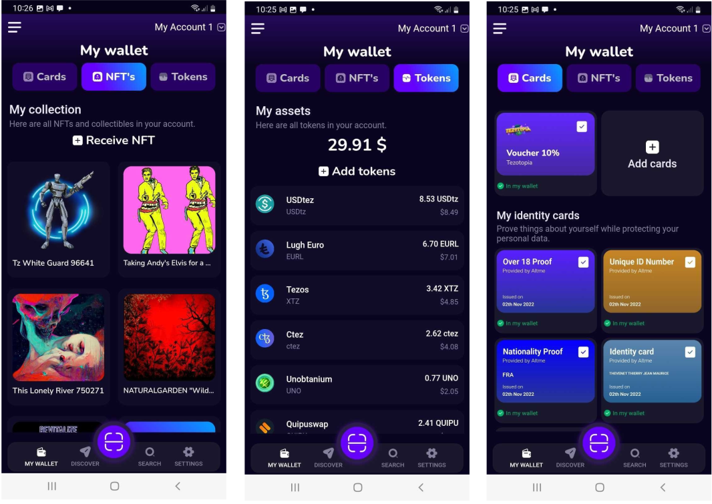

Introduction
============

Internet applications suffer from the lack of proper identity management. TCP/IP was designed as a network of networks with the sole purpose of identifying machines and not their users.
The rise of the web in the 90s favored the emergence of servers that concentrated user access and capitalized on stored data to the point of being today the identity providers of a significant part of humanity. .
The GAFAMs implemented an identity layer above TCP/IP because there was none and we all missed it.

For about ten years now, the concern for the protection of personal data has become a major subject for policies and new paths have been opened up, such as in particular the concepts of 
Self Sovereign Identity (SSI) which allows everyone to have their data in the format electronically as is done for paper data.

Web3 suffers like web2 from the lack of proper identity management. On the other hand, there are particularities which make SSI integration even more difficult:

* The users of web3 applications are even less docile than those of internet applications. they are more concerned with the management of their data because decentralized finance has already done its work.
* Web3 applications require on-chain data integration but the verifiable credentials we use in the SSI are off-chain data container by construction so we have to find solutions, tricks to make a bridge that allow both to use the technology provided by the blockchain while guaranteeing the protection of user data.

Web3 with SSI is now the full decentralization of data and assets : "Our keys, our data and assets".

What is Self Sovereign Identity ?
---------------------------------

Self-Sovereign Identity, or SSI, is a new technology compatible with blockchain that gives users and organizations the ability to control their own digital credentials
and identity data, rather than relying on a central authority or central database to manage their personal information. SSI does not require bockchain as a source of trust but DLT makes it easier to implement.

With SSI, users are able to store, manage and share their personal data in a decentralize manner, enabling greater privacy and security. SSI also uses Zero-Knowledge Proof and "Selective Disclosure" to protect
users privacy.

In practice SSI is an international standard defined by the World Wide Web Consortium (W3C) https://www.w3.org/ with two main documents :

* Verifiable credentials data model https://www.w3.org/TR/vc-data-model/ : an off-chain data container to gather personal data.
* Decentralized Identifiers https://www.w3.org/TR/did-core/ : a new generation of identifiers (DID) whose possession can be proven. 

As opposed to client-server architectures which are carried by 2 actors, SSI implements 3 actors : Issuers, Verifiers and Holders.

Issuers : they hold and issue verifiable digital credentials such as certificates of identity (ID card, company or service ID card …),
driver’s licenses (car/motorcycle, airplanes …), certificates (high school diploma, bachelor’s degree, master’s degree … ), confirmations (authenticity confirmation, vaccination confirmation, …) 
qualifications (license to practice medicine, nurse, master painter …), powers (official authority, residence authority …), 
qualifications (further education certificates, personal certificates …).

Verifiers : the acceptance points in this SSI ecosystem need verifiable digital evidence to use and further process the presented digital proof in a process or application.
For this purpose, the application can use the cryptographic from the SSI blockchain to verify the identity of the issuers. 
It is essential that the transmission of the verifiable digital evidence between the owner and the verifier is encrypted but verifibale credentials themselves are not required to be encypted.

Holders (or users) : they usually have a corresponding SSI app named wallet on their mobile device or desktop, which stores SSI private keys and the digital verifiable credentials. 
It is also possible to use a cloud agent. Holders can request all verifiable digital proofs from the corresponding issuers and store them in their own SSI wallet.

The use of the blockhain to support SSI is not mandatory and it is necessary to understand the relationship between the SSI and the Blockchain.
Verifiable credentials are totally off-chain data containers. The signature of the verifiable credential is itself integrated into the digital document itself, so it does not require a transaction on a blockchain.
On the other hand, the latter brings significant added value as a decentralized source of trust, in particular to make the link between a signature and the real identity of the issuers or verifiers.

An SSI wallet is different from a solution such as the Apple wallet because the user is the sole owner of his wallet and he can add new certificates to it without asking for authorization from a third party.
SSI is different from a solution such as Google Connect or FranceConnect because the user carries his data on him and is able to authenticate with a third party without intermediation.

Altme solution is made up of 3 offers
---------------------------------------

Altme offers 3 components to implement SSI in Web3 applications. On the other hand, it is important to appreciate that the strength of the SSI model is interoperability and 
therefore all the components offered by Altme are available in open source and implement protocols and standards recognized by the W3C and shared by the community.

* Altme Wallet : The user friendly SSI wallet for web3 applications
* Altme Saas : The next generation platform to build Issuers and Verifiers in minutes
* Altme Web3 Issuer : A trusted issuer of Web3 credentials 

Altme Wallet is an universal Wallet
-----------------------------------

The Altme wallet that we offer is a so-called "Universal" wallet. Altme is a user friendly SSI wallet with crypto features.

It is universal in that it allows you to manage in the same mobile application both your cryptos, NFT and your identity data in a decentralized way.

Identity must be understood in the broadest sense, this of course includes identity documents but also the personal data of our associative, cultural, professional and economic life.
Altme is simply an electronic version of the wallet we've had in our pockets for years. A Universal wallet is ultimately very common.

The Altme wallet is a new generation of wallet, it is likely that in the medium term other provider wallets will see the benefit of associating data with the transfer of assets.
identity allows a third party to manage its risk in an exchange. Identity is essential in any economic system.
A universal wallet is a wallet that carries the private keys of its crypto accounts and the verifiable credentials of its decentralized identity.

A universal wallet can buy, transfer and receive cryptos and NFTs and also receive and present verifiable credentials and verifiable presentations to the W3C standard.

In the following picture you can see the 3 most important screens of Altme Wallet with NFTs, Cryptos and Cards (verifiable credentials) carry by one user.

This also implies that a universal wallet supports both connection protocols with a dApp such as Beacon (or its walletConnect equivalent on EVM) and SSI protocols (WACI PEX, SIOPv2, ...DIDComm,..).
  
Altme Wallet is available on `Apple Store <https://apps.apple.com/fr/app/altme/id1633216869>`_ and `Google Play <https://play.google.com/store/apps/details?id=co.altme.alt.me.altme>`_  .

Altme Sass is a low code solution to build Issuers and Verifiers in minutes
-----------------------------------------------------------------------------

Altme Saas is a low code platform to generate issuers and verifiers. The platform is an open source project : https://github.com/TalaoDAO/sandbox

It makes it possible to verify qualified attributes of a Decentralized Identity or issue for instance a Pass in minutes without diving in complex Self Sovereign Identity concepts and tools.

To use Altme Saas, you don't need to learn Verifiable Credentials standards, DIDs signature or how to work with a complex SDK. Instead, Altme uses OpenID, WalletConnect or Beacon as a simple, familiar method to integrate issuers and verifiers in your Web3, Web2 or CMS application with no code or low code.

Access is free : https://talao.co

Altme Web3 Issuer is a SSI issuer for web3 use cases
------------------------------------------------------

We issue verifiable credentials in the format of Self Sovereign Identity for users of Crypto games, NFT Marketplaces, DeFi and Metaverse

We apply the principle of data minimization and thus credentials always carry the minimum data required for user needs. All credential data can be viewed in the wallet

Altme Issuer DID is did:web:app.altme.io:issuer

Altme Issuer DID document : 

.. code-block:: javascript

      {
            "@context": [
                  "https://www.w3.org/ns/did/v1",
                  {
                        "@id": "https://w3id.org/security#publicKeyJwk",
                        "@type": "@json"
                  }
            ],
            "assertionMethod": [
                  "did:web:app.altme.io:issuer#key-1"
            ],
            "authentication": [
                  "did:web:app.altme.io:issuer#key-1"
            ],
            "capabilityInvocation": [
                  "did:web:app.altme.io:issuer#key-1"
            ],
            "id": "did:web:app.altme.io:issuer",
            "keyAgreement": [
                  "did:web:app.altme.io:issuer#key-1"
            ],
            "verificationMethod": [
                  {
                        "controller": "did:web:app.altme.io:issuer",
                        "id": "did:web:app.altme.io:issuer#key-1",
                        "publicKeyJwk": {
                              "crv": "Ed25519",
                              "kty": "OKP",
                              "x": "FUoLewH4w4-KdaPH2cjZbL--CKYxQRWR05Yd_bIbhQo"
                        },
                        "type": "JwsVerificationKey2020"
                  }
            ]
      }

This issuer supports more than 20 credentials see : https://talao.co//sandbox/saas4ssi/credential_supported

Decentralized IDentifier (DID) of Altme Wallet
------------------------------------------------

We have chosen to use the DID method did:key for practical reasons.

It is a DID method which has numerous libraries.
Other DID methods can be used, but it seems to us, on the other hand, that it is preferable to be relatively far from the DID methods which are deduced from the blockchains and
which could leave the opportunity to confuse the private key of an identity with that of an account used for a transaction.

A description of the did key method is available here : https://w3c-ccg.github.io/did-method-key  

Altme Wallet can also support : did:ebsi, did:tz; did:pkh; did:sol; did:ion, did:eth, did:web with Ed25519, Secp256k1, P-256 and RSA keys.

DID private key vs blockchain address private key
-------------------------------------------------
It seems to us for example extremely dangerous to use by simplification the same private key of a blockchain address to support a decentralized identity.

The obvious risk is to eventually have an immediate correlation between an identity document issued for a user DID and blockchain transactions. 

For this, the choice we have made is to derive the private key(s) of our identity with a specific path different from that used for the crypto wallets.
Currently we use the derivation m/44'/5467'/0'/0 for the generation of identity keys which avoids any collision with that used for Tezos wallets m/44'/1729'/0'/0 or Metamask m/44'/60'/0'/0 while keeping the same passphrase.

The proof of blockchain address ownership
-----------------------------------------

It is a verifiable credential which is issued by the crypto wallet itself and whose subject is the identity carried by the wallet. Once presented to a verifier, it is a credential that has the signature of the two private keys.

From our point of view, this VC is one of the most important of the universal wallets because it makes it possible to establish in a peer to peer mode a link between the DID and the addresses
of the transactions while guaranteeing the maximum protection of the user's identity.

If it is desired to verify that the owner of an address "A" is over 18 years old, the verifier will receive a VC/VP proving age "over 18" and that specific VC which proves that the identity subject of the Over18 (vc.credentialSubject.id) is indeed the owner of the address "A".

For this very specific VC we use the DID method did:pkh perfectly fitted for DID based on crypto address : https://github.com/w3c-ccg/did-pkh/blob/main/did-pkh-method-draft.md

Example of a proof of blockchain account ownership with did:pkh:tz as the DID method of the crypto wallet for Tezos account.

.. code-block:: javascript

  {
      "@context": [ "https://www.w3.org/2018/credentials/v1", 
		{
			"TezosAssociatedAddress" : {
				"@id" : "https://github.com/TalaoDAO/context#tezosassociatedaddress",
				"@context" : {
					"@version": 1.1,
					"@protected": true,
					"id": "@id",
                    "type": "@type",
					"schema" : "https://schema.org/",
					"accountName" :  "schema:identifier",
      				"associatedAddress" : "schema:account",
					"cryptoWalletSignature" : "schema:identifier",
					"cryptoWalletPayload" : "schema:identifier",
					"issuedBy": {
						"@id": "schema:issuedBy",
						"@context": {
							"@version": 1.1,
							"@protected": true,
							"schema" : "https://schema.org/",
							"name" :  "schema:name"
						}
					}
       			}
			}
		}
   	],
	"id" : "urn:uuid:4cd16825-5872-43e5-8a56-7a2c5d5cb2f7",
	"type": [
        		"VerifiableCredential",
           		"TezosAssociatedAddress"
	],
	"issuer" : "did:pkh:tz:tz1YtKsJMx5FqhULTDzNxs9r9QYHBGsmz58o",
	"credentialSubject" : {
       		"id" : "did:key:zQ3sheeB1CHmCzYWxW13opsYv9AiS4atUAwfwzFoM2gRpifPb",
       		"type" : "TezosAssociatedAddress",
          	"associatedAddress" : "tz1YtKsJMx5FqhULTDzNxs9r9QYHBGsmz58o",
		    "accountName" : "Account 1",
			"issuedBy" : {"name" : "My wallet"}
	}
   }

Give an Identity to your crypto wallet
--------------------------------------

This is a service offers by Atme, free and available here :  https://app.altme.io/wallet-link

Current crypto wallets like Metamask, Trust wallet, Ledger or Temple wallet for Tezos do not carry personal data as verifiable credentials. 
We think that they will do it in a more or less close future to adapt to regulations but for the moment 
it is therefore extremely difficult to know the user who is carrying out a transaction. In some cases this can be a problem.

The use of processes such as the KYC carried out by the site of the Web3 platform responds badly to this problem for at least two reasons:

* it reveals all of a user's personal data to the operator and some of it is unnecessary for the strict need of the application.
* it is often impossible to ensure that the crypto address is indeed owned by the person performing the KYC.

The use of an SSI wallket easily solves this problem because it allows the user to transfer only the minimum information, necessary and moreover it makes the link between the DID and the transaction addresses (see above ). 
However, to take advantage of these advantages with a crypto wallet, it is necessary to associate your crypto wallet with Altme.

The association of a crypto wallet to Altme can be done in 2 ways:

* By transferring the private key (or passphrase) from the crypto wallet to the Altme wallet. The crypto account is then available on Altme as if it had been created by Altme.
* By creating in Altme proof of ownership of the crypto private key without even revealing it. This is possible using the Beacon Tezos or WalletConnect EVM protocols and the service offered by the site https:/app.altme.io/wallet-link

The Altme wallet can therefore carry the verifiable credentials of the user of a wallet such as Metamask or Ledger, which then simplifies and secures the onboarding of this user on web3 platforms.

Web3 Verifiers
--------------

The Verifier is the module of an application or an application whose purpose is to control the accuracy and origin of Verifiable Credentials / Verifiable presentations of a user (Holder).

The protocols supported by the Verifiers are the subject of numerous documentation in the repositories of the DIF and in those of the SSI ecosystems. In our case we opted for the use of Verifiable Presentation Request (w3C draft) or SIOPv2.
The simplest use cases of a Verifier consist in validating that a user has the necessary credentials (Over 18 or Over 13 to access a marketplace, KYC/AML to access a DEX, etc).

It is therefore relatively basic information that is generally called a "verification result" and which is then transferred to the dApp. 
This information contains very little personal data of the user but on the other hand it is possible that the Verifier received and stored to carry out its process a greater number of information. 

For this reason in particular, it seems to us that the Verifier must remain an external and independent service.

The multi-criteria approach makes it possible to deal with complex use cases involving several criteria. 
An example is that of a voting application that would like to whitelist only users who live in a specific city and who are, for example, under 25 years old.

On-chain integration with anonymous whitelist
----------------------------------------------

In an SSI environment, the user carries their data in their wallet. At each onboarding he is able to present his VCs. 
Data wallets (SSI wallets) have here a very big advantage over crypto wallets which can only hope that another dApp has previously created an on-chain record to mark an address as verified.

But even with data wallet, the question of data persistence arises for asynchronous actions such as that of an NFT drop or an ICO conditioned by a minimum subscription.
In this case it is necessary to keep a list of addresses that have presented themselves beforehand, sometimes several weeks before the action.

For a hybrid application that has a base on a server, the implementation is simple. For a dApp you need a storage alternative.

This is where blockchain comes into play in the interaction of SSI and web3.

VCs are inherently off-chain as they protect user data and regulations in many countries now include the right to be forgotten.
It is therefore not possible to have a copy of a chained VC. It seems to us that even a "verification result" is already personal data that should not be exposed on chain.
The choice we have made is to use "anonymous" whitelists created at the start of the application.

A whitelist is managed by a smart contract which allows to create whitelists adapted to each use case and then to add the blockchain addresses of the users of the service.
It is created at the same time as the verifier. It must be able to be consulted by a smart contract of the application. Checking it updates the whitelist.

The verifier pays the transaction fees and the verifier's DID must be known to the wmart contract to validate the forwarding address.

